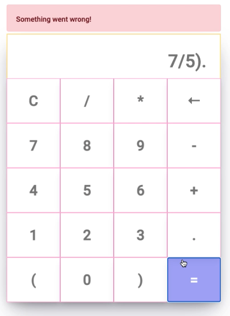
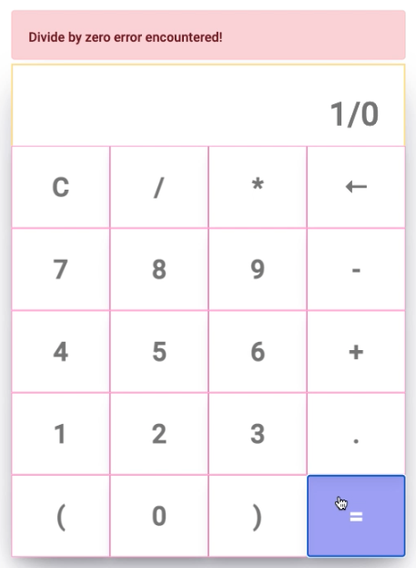

#Odev 1

## Built With 🔨
<ul>
    <li> HTML</li>    
    <li> CSS </li>   
    <li>Javascript</li> 
</ul>

## V1

<pre>
<code>
const displayInput = document.getElementById("display-input");
const buttons = Array.from(document.getElementsByClassName("calc-btn"));
buttons.forEach((button) => {
  button.addEventListener("click", (e) => {
    switch (e.target.textContent) {
      case "C":
        displayInput.textContent = "";
        break;
      case "←":
        displayInput.textContent = displayInput.textContent.slice(0, -1);
        break;
      case "=":
        displayInput.textContent = eval(displayInput.textContent);
        break;
      default:
        displayInput.textContent += button.textContent;
    }
  });
});
</code>
</pre>

## V2

<pre>
<code>
const displayInput = document.getElementById("display-input");
const buttons = Array.from(document.getElementsByClassName("calc-btn"));
const errorMessage = document.getElementById("err-message");

buttons.forEach((button) => {
  button.addEventListener("click", (e) => {
    switch (e.target.textContent) {
      case "C":
        displayInput.textContent = "";
        break;
      case "←":
        displayInput.textContent = displayInput.textContent.slice(0, -1);
        break;
      case "=":
        getResult();
        break;
      default:
        displayInput.textContent += button.textContent;
    }
  });
});

const getResult = () => {
  try {
    const result = eval(displayInput.textContent);
    if (result !== Infinity) {
      displayInput.textContent = result;
    } else {
      getError("Divide by zero error encountered!");
    }
  } catch (e) {
    getError("Something went wrong!");
  }
};

const getError = (message) => {
  errorMessage.style.display = "block";
  errorMessage.textContent = message;
  setTimeout(() => {
    errorMessage.style.display = "none";
  }, 5000);
};
</code>
</pre>

# Screenshots :camera_flash:

